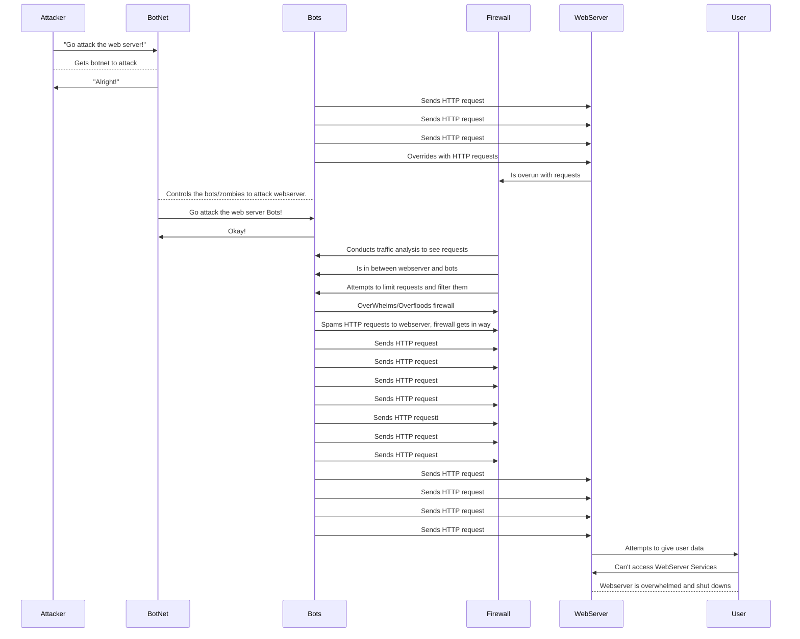

```mermaid
sequenceDiagram
participant Attacker
participant BotNet
participant Bots
participant Firewall
participant WebServer
participant User

Attacker->>BotNet: "Go attack the web server!"
Attacker-->BotNet: Gets botnet to attack 
BotNet ->> Attacker: "Alright!"
Bots ->> WebServer: Sends HTTP request
Bots ->> WebServer: Sends HTTP request
Bots ->> WebServer: Sends HTTP request
Bots ->> WebServer: Overrides with HTTP requests
WebServer ->> Firewall: Is overun with requests
BotNet --> Bots: Controls the bots/zombies to attack webserver.
BotNet ->> Bots: Go attack the web server Bots!
Bots ->> BotNet: Okay!
Firewall ->> Bots: Conducts traffic analysis to see requests
Firewall ->> Bots: Is in between webserver and bots
Firewall ->> Bots: Attempts to limit requests and filter them
Bots ->> Firewall: OverWhelms/Overfloods firewall
Bots ->> Firewall: Spams HTTP requests to webserver, firewall gets in way
Bots ->> Firewall: Sends HTTP request
Bots ->> Firewall: Sends HTTP request
Bots ->> Firewall: Sends HTTP request
Bots ->> Firewall: Sends HTTP request
Bots ->> Firewall: Sends HTTP requestt
Bots ->> Firewall: Sends HTTP request
Bots ->> Firewall: Sends HTTP request
Bots ->> WebServer: Sends HTTP request
Bots ->> WebServer: Sends HTTP request
Bots ->> WebServer: Sends HTTP request
Bots ->> WebServer: Sends HTTP request
WebServer ->> User: Attempts to give user data
User ->> WebServer: Can't access WebServer Services 
WebServer --> User: Webserver is overwhelmed and shut downs
```