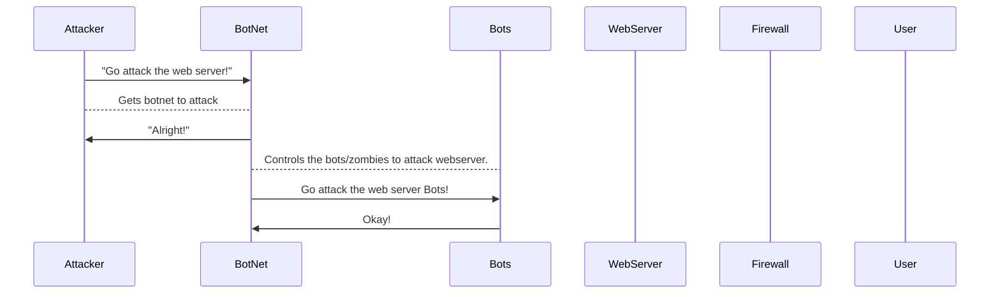

```mermaid
sequenceDiagram
participant Attacker
participant BotNet
participant Bots
participant WebServer
participant Firewall
participant User

Attacker->>BotNet: "Go attack the web server!"
Attacker-->BotNet: Gets botnet to attack 
BotNet ->> Attacker: "Alright!"
BotNet --> Bots: Controls the bots/zombies to attack webserver.
BotNet ->> Bots: Go attack the web server Bots!
Bots ->> BotNet: Okay!
```
ddos nooo