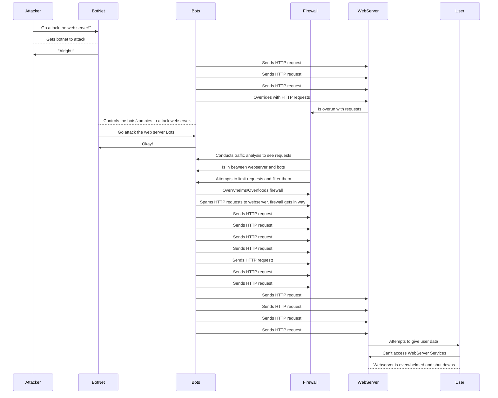

## Documentation
In a DDos attack (Distributed Denial-of-serive attack) an attacker purchases, uses, or makes their own botnet to perform the DDos attack. This can be due to many reasons such as a particular grudge against a webserver or just for their own entertainment. Then the botnet controls bots/zombies in order to spam or flood a web server with HTTP requests to overwhelm the server into shutting down or slowing down.

The bots begin to send several HTTP requests as seen in the diagram, but the firewall helps protect the webserver by conducting traffic analysis and limiting possible malicious requests.

However at some point the firewall is overwhelmed and it cannot keep up with HTTP requests and they start heading directly to the webserver. The webserver is quickly overflooded with requests and will either shutdown or slow down significantly.

The user is impacted the most, as they will go to the webserver to request a service just to find out that it is shut down or slowed making them use another web service or having to wait a long time.