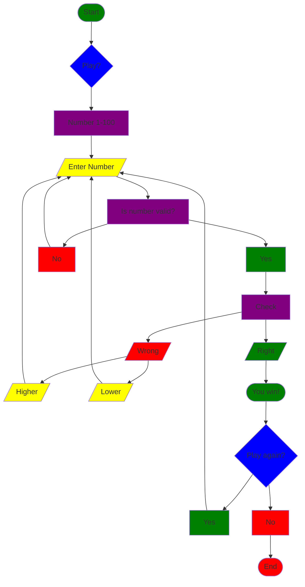

### Documentation
This app generate a number 1 - 100 and then gets the user to guess it in that range by entering the number. It will check if the number is valid in the 1 - 100 range or if it is something other than the number, and if not it will tell the user to enter the number again.

The program then computes the number to see if it is right or not, and if it is wrong then the program will tell the user if the number is higher or lower until they get the correct number. If they guess on the first try they are told they are correct and that they win.

After winning the user can choose to play again, repeating the entire game. 