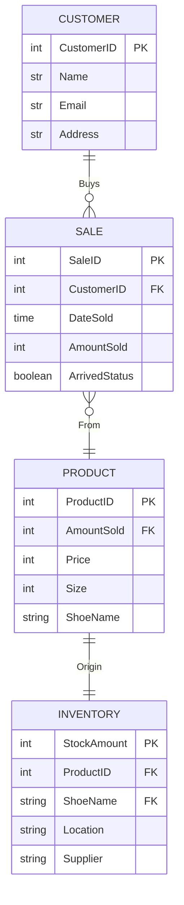

## Documentation
This chart illustrates the relationships between the customer, sale, product, and inventory of a NIKE shoe store. 
* Customer:
    * Includes customer ID, name, email, and home address (Main part is customer ID) to identify them
    * Gives customer ID to sale ID in order to buy a product they purchased
    * There can only be one and only one customer
    * A customer can buy 0 to many items

* Sale:
    * How Nike makes its profits
    * Includes SaleID to track items sold, CustomerID to see who buyed, the date of the item sold, The amount of tiems sold, and to see if the item has arrive or not as either true or false. 
    * Sales can be from 0 to many sales
    * Theres can be only 1 and only 1 product which sales come from

*  Product:
    * The actually product of the item
    * Includes amountSold from Sales to see how much product sales need to sell to the customer
    * Includes price, size and name of the shoes NIKE is selling
    * There can be 1 and only 1 product when selling
    * There can only be 1 and only 1 inventory when getting it from the inventory

* Inventory:
    * Includes inventory of all of the items
    * StockAmount shows all of the shoes avaible in stock
    * ShoeNames are also in inventory
    * Also includes location and supplier of shoes
    * There can only be 1 and only 1 Inventory of shoes for the product